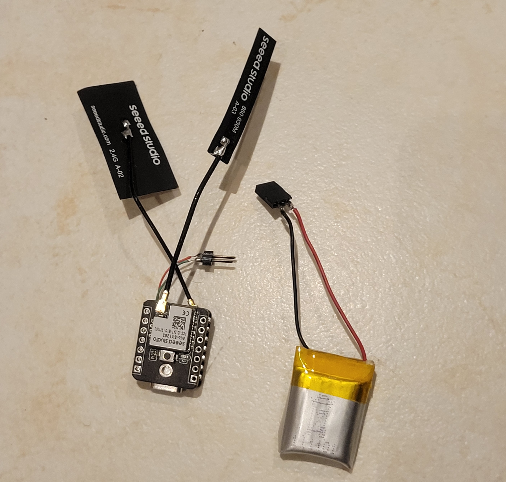
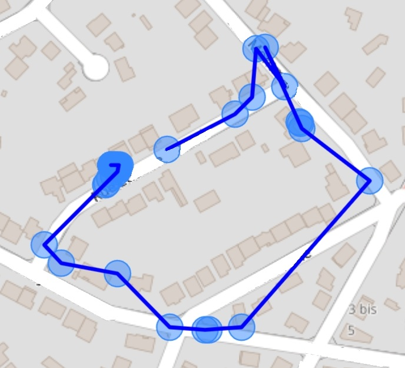
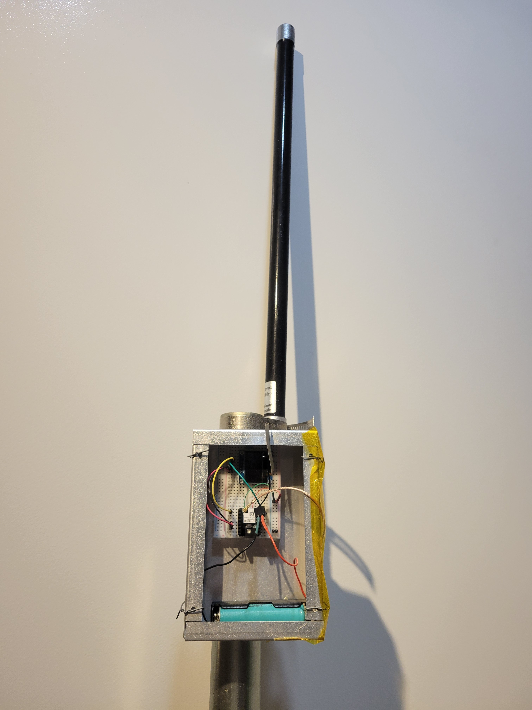
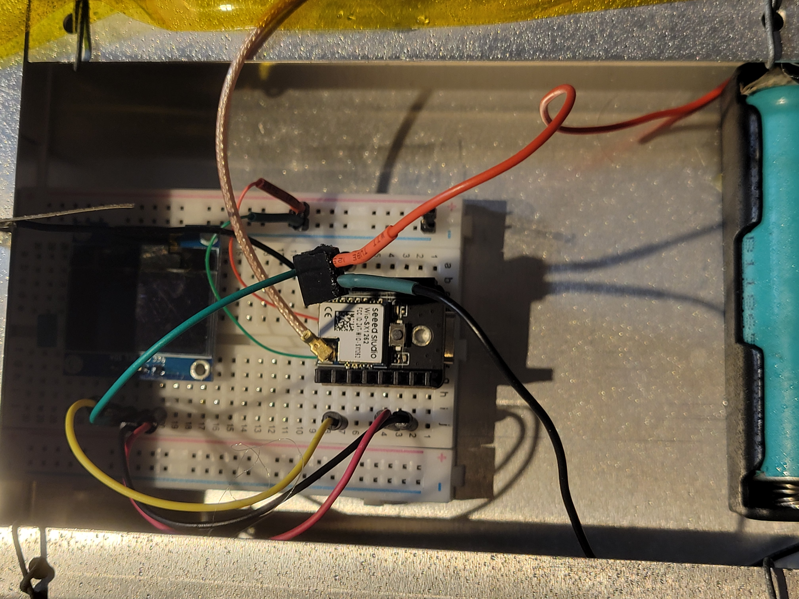

# Another pet tracker

Ths traker is meant for use in dense areas where there are numerous wifi hotspots.

Using lora, the base station interrogates the tracker periodically to get a report of the pet tracker surrouding wifi base stations.

The tracker reports the bssids it receives along with the signal strength (rssi) of the stations.

Geolocation is done by a python web and API server fed by the station side using the bssid as data and the wigle.net database.

Hardware used is XIAO ESP32S3 & Wio-SX1262 Kit from seeed studio, any ESP32 and SX1262 combination should work without modifications.

This is work in progress.

  
  

  
  

